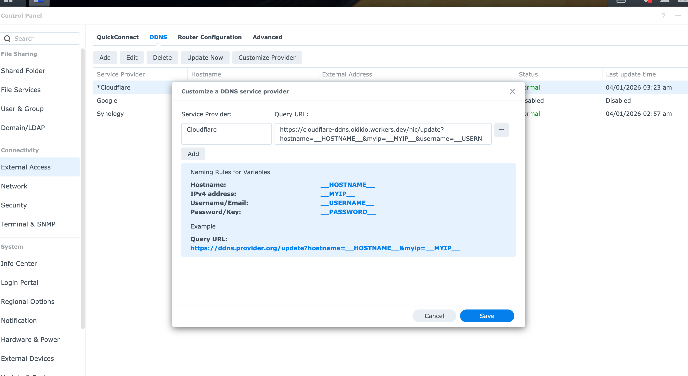

# Cloudflare DDNS


[](https://deploy.workers.cloudflare.com/?url=https://github.com/okikio/cloudflare-ddns)

A Cloudflare Worker that keeps DNS records in sync with your changing public IP address. Designed for Synology NAS devices but works with any HTTP client.

When your NAS or a cron script calls this worker, it reads the caller's IP from the request, compares it to the existing Cloudflare DNS record, and creates or patches the record if needed. Responses follow the DynDNS2 protocol so Synology DSM recognizes them natively.



> [!NOTE]
> Use Deploy to Cloudflare if you want Cloudflare to create your own copy of the repo, provision supported resources such as D1, and build the Worker for you. This avoids a manual local clone, but Cloudflare's documented button flow still creates a new GitHub or GitLab repository copy for the user. Keep your zone-specific values ready before you start: the setup flow still needs your Cloudflare API token, zone ID, shared secret, and allowed hostnames. The helper links below are the fastest way to gather them.

## Features

- Synology DSM custom DDNS provider compatibility (`GET /nic/update`)
- JSON API for scripts and automation (`POST /update` with OpenAPI docs)
- IPv4 (A) and IPv6 (AAAA) support
- Optional D1-backed audit log with scheduled cleanup
- Hostname allowlist to limit what records can be changed
- Configurable proxied/DNS-only mode and TTL

## Quick start

Choose the path that matches how you want to manage the project:

- Deploy to Cloudflare for a dashboard-led setup and a repo copy in your own GitHub account
- Local setup with a few explicit Wrangler helper commands if you want the repo on disk

Use the local path for a more hands on deploy:

```sh
git clone https://github.com/okikio/cloudflare-ddns.git
cd cloudflare-ddns
pnpm install
pnpm setup:secrets
pnpm run deploy
```

If you want to attach a specific D1 database and run explicit remote migrations from a local clone, keep reading.

## Before you deploy

If you want the easiest Deploy to Cloudflare path, open these in separate tabs before you press the button:

- [API token templates](https://developers.cloudflare.com/fundamentals/api/reference/template/) for Cloudflare's `Edit Zone DNS` template, which grants the zone-scoped `DNS Write` permission this worker needs. Restrict the token to the one zone you want this worker to manage.
- [Create API token](https://developers.cloudflare.com/fundamentals/api/get-started/create-token/) if you want Cloudflare's step-by-step token creation flow after confirming the right template and permission.
- [Find account and zone IDs](https://developers.cloudflare.com/fundamentals/account/find-account-and-zone-ids/) if you do not already know where Cloudflare shows the zone ID.
- [1Password password generator](https://1password.com/password-generator/) or [Bitwarden password generator](https://bitwarden.com/password-generator/) if you want a browser-based shared secret generator from a reputable password-manager vendor.

You will still need to choose the hostnames this worker may update, for example `nas.example.com,*.nas.example.com`.

Deploy to Cloudflare can prefill descriptions and defaults, but it cannot currently give you a zone picker or generate the shared secret inside the form. The most reliable path is Cloudflare's built-in `Edit Zone DNS` token template plus these lookup links.

## Prerequisites

- A [Cloudflare account](https://dash.cloudflare.com/sign-up) (free tier works)
- A domain with its DNS managed by Cloudflare
- A [Cloudflare API token](https://dash.cloudflare.com/profile/api-tokens) created from Cloudflare's [API token templates](https://developers.cloudflare.com/fundamentals/api/reference/template/) page using the `Edit Zone DNS` template. That template grants the zone-scoped `DNS Write` permission this worker needs.
- Your zone ID from the domain overview page in the Cloudflare dashboard. Cloudflare documents the lookup flow in [Find account and zone IDs](https://developers.cloudflare.com/fundamentals/account/find-account-and-zone-ids/).
- [Node.js](https://nodejs.org/) 22+ and [pnpm](https://pnpm.io/) 9+

## Setup

### Local Wrangler setup

### 1. Clone and install

```sh
git clone https://github.com/okikio/cloudflare-ddns.git
cd cloudflare-ddns
pnpm install
```

### 2. Create the D1 database

```sh
npx wrangler d1 create cloudflare-ddns-db
```

If you want the database provisioned before the first deploy, copy the generated D1 binding back into your local `wrangler.jsonc`, or use `pnpm setup:db` to create the database and write that binding for you.

If you skip this step, keep the committed `d1_databases` entry as-is. Wrangler can automatically provision the D1 database from that binding during `pnpm run deploy`, Workers Builds, or Deploy to Cloudflare. This is the default template path.

If you use Cloudflare Workers Builds with Git integration, set the project Deploy command to `pnpm run deploy` instead of `npx wrangler deploy`. This repository uses a pnpm workspace, so `pnpm deploy` runs pnpm's built-in workspace deploy command rather than the package script. `pnpm run deploy` is the form that runs this repository's plain `wrangler deploy` script.

If you already have an existing D1 database that your own Worker must keep using, set the `DDNS_D1_DATABASE_ID` environment variable in your local shell or in Workers Builds. The deploy script will generate a temporary `.wrangler/deploy/wrangler.generated.jsonc` file containing that real `database_id` only for the current deploy. The committed template config remains unchanged.

### 3. Set secrets

```sh
cp .env.production.example .env.production
# edit .env.production with your real values
npx wrangler secret bulk .env.production
```

You can also use `pnpm setup:secrets`, which prompts for the values and uploads them safely in one pass.

| Secret | Description |
|---|---|
| `CF_API_TOKEN` | Cloudflare API token for your zone created from Cloudflare's [API token templates](https://developers.cloudflare.com/fundamentals/api/reference/template/) page using the `Edit Zone DNS` template. That template grants the required zone-scoped `DNS Write` permission. |
| `CF_ZONE_ID` | Zone ID from your domain Overview page. If you do not know where to look, use [Find account and zone IDs](https://developers.cloudflare.com/fundamentals/account/find-account-and-zone-ids/). |
| `DDNS_SHARED_SECRET` | A password you choose. Callers must send this to authenticate. Use at least 32 random characters. |
The repository includes [`.env.production.example`](./.env.production.example) so the manual upload path has a ready-made template.

### 4. Configure allowed hostnames

Set `DDNS_ALLOWED_HOSTNAMES` in `wrangler.jsonc` under `vars`:

```jsonc
"vars": {
  "DDNS_ALLOWED_HOSTNAMES": "nas.example.com,*.nas.example.com",
  "DDNS_PROXIED": "false",
  "DDNS_TTL": "1",
  "DDNS_LOG_RETENTION_DAYS": "30"
}
```

You can also use `pnpm setup:secrets`, which uploads the actual secrets and writes `DDNS_ALLOWED_HOSTNAMES` into `wrangler.jsonc` for you.

### 5. Deploy

```sh
pnpm run deploy
```

This runs a standard `wrangler deploy`.

For this repository's default template path, the Worker deploys without requiring a pre-existing D1 `database_id`. DDNS updates still work before the audit-log table exists, but D1-backed audit logging only becomes active after you apply the SQL migrations from a local/operator workflow.

Workers Builds does not need a dedicated D1 build secret for this repository when you want the template-safe default path. Use the committed D1 binding and set the Deploy command to `pnpm run deploy`.

If you are deploying your own long-lived Worker and want it to keep the same existing D1 database, add `DDNS_D1_DATABASE_ID=<your-existing-database-uuid>` to the Workers Builds environment variables. `pnpm run deploy` will then inject that `database_id` into a generated deploy-only Wrangler config before running `wrangler deploy`.

If you want to manage the D1 database explicitly after cloning locally, run:

```sh
pnpm setup:db
pnpm setup:secrets
pnpm run migrate:remote
pnpm run deploy
```

That path writes a real `database_id` into your local `wrangler.jsonc`, uploads the required secrets, applies the SQL migrations remotely, and then deploys the Worker. It is the recommended way to enable the D1-backed audit log from a local/operator workflow.

If you want the same behavior in CI or Workers Builds without committing the ID, set `DDNS_D1_DATABASE_ID` and then use:

```sh
pnpm run migrate:remote
pnpm run deploy
```

`pnpm run migrate:remote` requires `DDNS_D1_DATABASE_ID` because remote D1 operations need the real database UUID.

## Environment variables

These non-secret variables live in `wrangler.jsonc` and can be overridden per-environment:

| Variable | Default | Description |
|---|---|---|
| `DDNS_ALLOWED_HOSTNAMES` | none | Required. Comma-separated hostnames this worker may update, e.g. `nas.example.com,home.example.com`. Wildcard companions such as `*.nas.example.com` are supported as explicit entries. |
| `DDNS_PROXIED` | `"false"` | Whether DNS records are proxied through Cloudflare. Most NAS setups need `"false"` (DNS-only) for direct IP access on non-standard ports. |
| `DDNS_TTL` | `"1"` | DNS record TTL in seconds. `"1"` means automatic. Valid range: 60-86400. |
| `DDNS_LOG_RETENTION_DAYS` | `"30"` | How many days of update logs to keep in D1. A cron job runs every 6 hours to prune older rows. |

## Usage

### Synology DSM

If you want a screenshot-led DSM walkthrough for non-technical users, use [docs/synology-setup.md](docs/synology-setup.md).

In **Control Panel > External Access > DDNS > Customize**:

| Field | Value |
|---|---|
| Service Provider | Any name, e.g. `Cloudflare DDNS` |
| Query URL | `https://<your-worker>.workers.dev/nic/update?hostname=__HOSTNAME__&myip=__MYIP__&username=__USERNAME__&password=__PASSWORD__` |

Then add a DDNS entry:

| Field | Value |
|---|---|
| Service Provider | The custom provider you just created |
| Hostname | `nas.example.com` (must be in your allowed list) |
| Username | Anything (not used, but DSM requires a value) |
| Password | Your `DDNS_SHARED_SECRET` |

DSM will call the worker whenever it detects an IP change. The worker responds with `good <ip>` or `nochg <ip>` on success.

If you want one request for `nas.example.com` to also update `*.nas.example.com`, include both in `DDNS_ALLOWED_HOSTNAMES`, for example `nas.example.com,*.nas.example.com`. The worker treats the wildcard entry as a second managed DNS record and updates both records together.

### JSON API

```sh
curl -X POST https://<your-worker>.workers.dev/update \
  -H "Content-Type: application/json" \
  -H "X-DDNS-Secret: <your-secret>" \
  -d '{"hostname": "nas.example.com", "ip": "203.0.113.1"}'
```

Omit `ip` to use the caller's public IP (from Cloudflare's `CF-Connecting-IP` header). Omit `hostname` to default to the first hostname in your allowed list.

Wildcard records work the same way here: if `DDNS_ALLOWED_HOSTNAMES` contains both `nas.example.com` and `*.nas.example.com`, a JSON update request for `nas.example.com` updates both records and returns per-target results in the response.

OpenAPI documentation is served at the worker's root URL (`/`).

### Health check

```
GET /health  ->  {"ok": true}
```

## Development

```sh
pnpm dev     # starts wrangler dev with local D1 migrations
pnpm test    # runs vitest with Miniflare
```

## Continuous integration

GitHub Actions runs `pnpm test` for pull requests and pushes to `main` on Node.js 22 and 24.
Dependabot checks the workflow action references weekly so the CI setup stays current.

## How it works

1. The caller authenticates with a shared secret (query param or header).
2. The worker validates the hostname against the configured allowlist.
3. It resolves the IP from the request body/query, falling back to `CF-Connecting-IP`.
4. It resolves the request to one or more managed hostnames. For example, `nas.example.com` can fan out to both `nas.example.com` and `*.nas.example.com` when both are explicitly allowed.
5. It queries Cloudflare's DNS API for an existing A or AAAA record matching each target hostname.
6. If a target record already has the same IP, proxied state, and TTL, no change is made for that target (`nochg`).
7. Otherwise it creates or patches that target record (`good`).
8. The outcome is logged to D1 once per concrete DNS record (fire-and-forget, so the response is not delayed).
9. A cron job (every 6 hours) prunes log rows older than the retention period.

## Wildcard notes

- Cloudflare wildcard DNS records only wildcard the first label. `*.nas.example.com` is a wildcard record, but `subdomain.*.example.com` is not.
- Exact DNS records take precedence over wildcard records on Cloudflare. `nas.example.com` and `*.nas.example.com` are separate records with different jobs.
- This worker only auto-updates a wildcard companion when that wildcard record is explicitly present in `DDNS_ALLOWED_HOSTNAMES`.

## Project structure

```
src/
  index.ts             Main app, route wiring, scheduled handler
  types.ts             DdnsEnv interface, response/action constants
  ddns.ts              Shared update logic (findRecord, compare, create/patch)
  cloudflare-api.ts    Typed wrapper around Cloudflare DNS REST API
  validation.ts        IP validation, config parsing (no dependencies)
  logging.ts           Best-effort D1 audit logging and cleanup
  endpoints/
    synology.ts        GET /nic/update  (DynDNS2 text responses)
    update.ts          POST /update     (JSON, OpenAPI via Chanfana)
    health.ts          GET /health
migrations/
  0001_ddns_logs.sql   D1 table for update history
tests/
  helpers.ts           Mock Cloudflare DNS API for tests
  integration/         Integration tests (health, synology, update)
```
